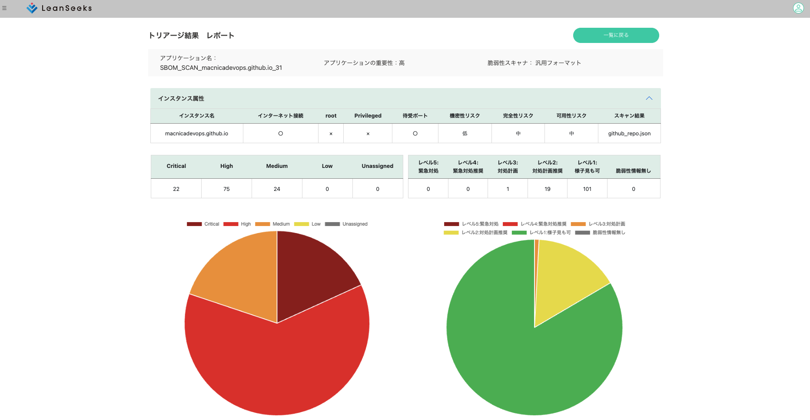

### ls-demo02

# GitHubの指定リポジトリからSBOMをエクスポートし、脆弱性情報を取得の上トリアージを行います。

1. .circleci/config.ymlの18行目でリポジトリオーナー、19行目でリポジトリ名を指定
2. 27行目−29行目は処理に必要なパッケージのインストール
3. getSBOM.shでGitHubの指定リポジトリからSBOMをエクスポートし、LeanSeeksのフォーマットに変換
   1. この際、SBOMから脆弱性情報を取得するためにosv-scannerを利用
   2. osv-scannerの出力のCVSSベクターからCVSSスコアとセベリティを取得するためにcvss_calculatorを利用
4. triage.shでLeanSeeksにデータを登録してトリアージを実行

トリアージ結果(2023年5月時点)
